* 单个客户端执行 ls 正常输出

  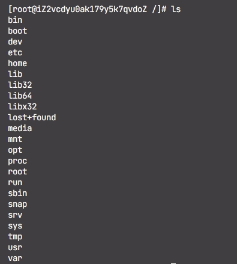
* 多客户端同时操作不混乱
  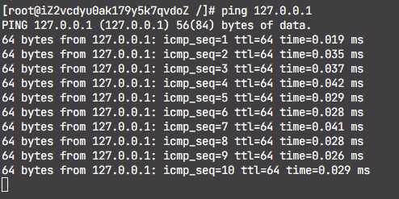

  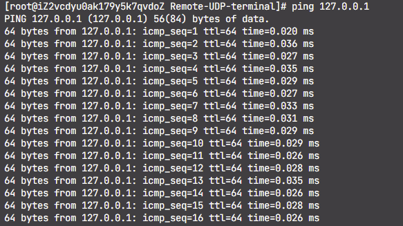

    两个终端连接同时ping不混乱

* 断开网络后出现超时重传
  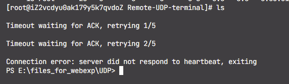

  此时关闭服务端
  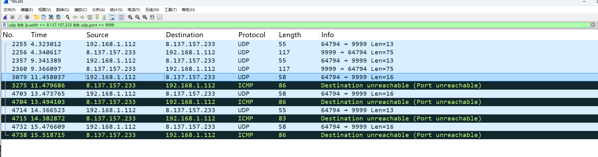

  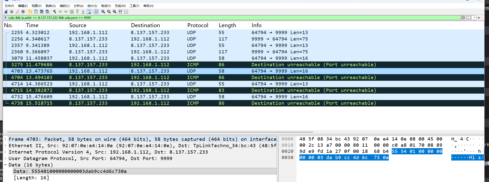

    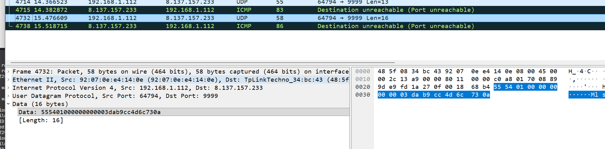

    可见13、15号包时11号的超时重传包（len=16，也就是13字节协议头加上ls\n共计16字节），14号数据报时心跳包

* 心跳正常，离线可检测

  服务端心跳

  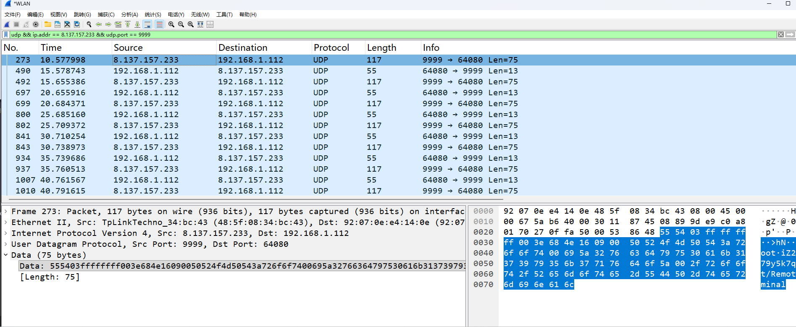

  客户端心跳：

  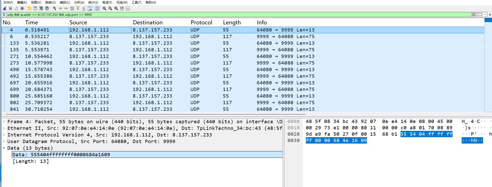

  服务端显示：
  
* ping 命令可实时输出并能用 Ctrl+C 中断
  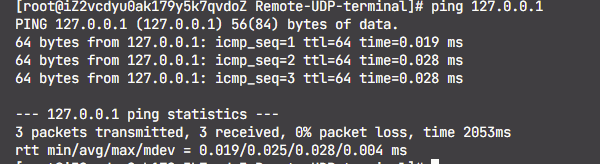
* 拔高：top 可正常显示界面并退出
  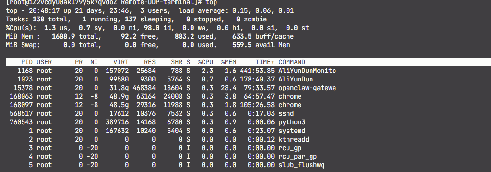
  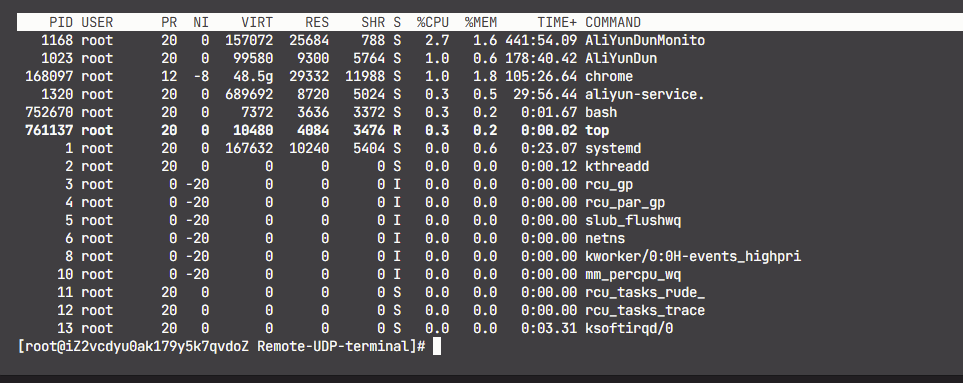
